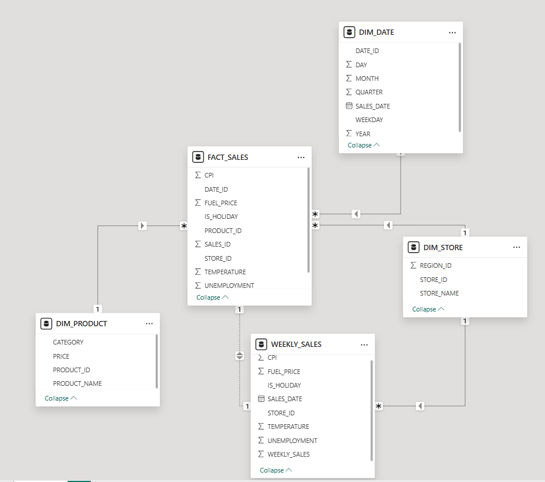

# **Building a Retail Data Pipeline and Visualization**

This project focuses on analyzing Walmart sales data using a Snowflake database and creating a Power BI dashboard for key business insights. The workflow involves data extraction, transformation, loading (ETL), and visualizing critical KPIs and trends to derive actionable insights.

---

## **📌 Project Overview**

The Walmart Sales Analytics project demonstrates the following:
1. Building a **star schema** in Snowflake to organize sales data.
2. Extracting, transforming, and loading data into Snowflake using **Python**.
3. Designing a **Power BI dashboard** to visualize sales trends, performance, and key KPIs.
4. Providing business insights such as YoY growth, top-performing stores, and sales trends by region and holiday periods.

---

## **📊 Dashboard Features**


The dashboard provides a concise overview of Walmart sales data with the following features:
- **Total Revenue (KPI)**: Displays the overall revenue generated.
- **YoY Sales Growth % (KPI)**: Highlights year-over-year growth in sales.
- **Sales by Stores**: Identifies the top-performing stores.
- **Sales by Holiday**: Compares sales during holiday and non-holiday periods.
- **Sales by Year and Quarter**: Visualizes sales trends over time.
- **Sales and CPI Trends**: Correlates sales with the average Consumer Price Index (CPI).

---

## **🗃️ Database Schema**



The project uses a **star schema** in Snowflake, comprising:
1. **Fact Table: `fact_sales`**
   - Contains transactional data (e.g., weekly sales, CPI, unemployment, etc.).
2. **Dimension Tables**:
   - **`dim_date`**: Date attributes (e.g., year, month, quarter).
   - **`dim_store`**: Store attributes (e.g., store name, region).
   - **`dim_product`**: Product attributes (e.g., category, price).
   - **`dim_region`**: Geographical regions.

### **Data Workflow**
- **ETL Process**: Data was extracted from Kaggle, transformed using Python, and loaded into Snowflake.
- **Star Schema**: Designed for optimized analytical queries.

---

## **🛠️ Tools & Technologies**

### **1. ETL Tools**
- **Python**:
  - Libraries: `pandas`, `snowflake.connector`, `shutil`, `os`.
- **Snowflake**:
  - Cloud database for data storage and schema design.

### **2. Visualization**
- **Power BI**:
  - Dashboard with KPIs, time-series analysis, and geographical insights.

### **3. Data Source**
- Dataset: **[Walmart Sales Dataset from Kaggle](https://www.kaggle.com/datasets/rutuspatel/walmart-dataset-retail)**.

---

## **📈 Key Insights**
1. **Top Stores**: Store 20 and Store 4 generated the highest revenue.
2. **Holiday Sales**: Sales during holidays contributed to 7.5% of total revenue.
3. **Sales Growth**: YoY sales increased by **58.94%**, reflecting significant business growth.
4. **Regional Sales**: Sales trends by region provided insights into demand distribution.
5. **CPI Impact**: A positive correlation between CPI and sales was observed.

---

## **⚙️ How to Reproduce**

### **1. Clone the Repository**
```bash
git clone https://github.com/binita-roy/Building-a-Retail-Data-Pipeline-and-Visualization.git
```
## **2. Set Up Snowflake**
- **Create a Snowflake database and schema** based on the provided SQL scripts.
- **Load the transformed data** into Snowflake using Python ETL scripts.

---

## **3. Run the Python Scripts**
The ETL process is automated using Python scripts:

1. **Extract Data**:  
   - Script: `extract.py`  
   - Downloads the dataset from Kaggle and saves it to the local project directory.

2. **Transform Data**:  
   - Script: `transform.py`  
   - Cleans and formats the raw data to make it compatible with the Snowflake schema.

3. **Load Data**:  
   - Script: `load.py`  
   - Loads the transformed data into the Snowflake database.

4. **ETL Pipeline**:  
   - Script: `etl_pipeline.py`  
   - Combines the **Extract**, **Transform**, and **Load** steps into a single automated workflow.

---

## **4. Connect Power BI to Snowflake**
- **Connect Power BI to Snowflake** using the ODBC driver.
- **Import data into Power BI** and build the visualizations.

---

## **📂 Project Structure**
```plaintext
├── data/                     # Raw and transformed data files
├── scripts/                  # Python scripts for ETL
│   ├── extract.py            # Extract data from Kaggle
│   ├── transform.py          # Transform raw data
│   ├── load.py               # Load data into Snowflake
│   ├── etl_pipeline.py       # Automates the entire ETL pipeline
├── PowerBI/                  # Power BI Dashboard file (.pbix)
├── SQL/                      # SQL scripts for Snowflake schema and queries
├── README.md                 # Project documentation
````

## **🔗 Key Resources**
- **Kaggle Dataset**: [Walmart Sales Data](https://www.kaggle.com/datasets/rutuspatel/walmart-dataset-retail)
- **Power BI**: [Download Power BI](https://powerbi.microsoft.com/)

---

## **💡 Future Enhancements**
1. Implement **real-time analytics** with Snowflake's streaming capabilities.
2. Add advanced visualizations like **sales forecasting** using Power BI AI visuals.
3. Incorporate additional data sources for **more in-depth analysis**.

---

## **📧 Contact**
For any questions or feedback, feel free to reach out:
- **Email**: [binitaroy1312@gmail.com](mailto:binitaroy1312@gmail.com)
- **LinkedIn**: [https://www.linkedin.com/in/binita-roy/](https://www.linkedin.com/in/binita-roy/)
- **GitHub**: [https://github.com/binita-roy](https://github.com/binita-roy)
